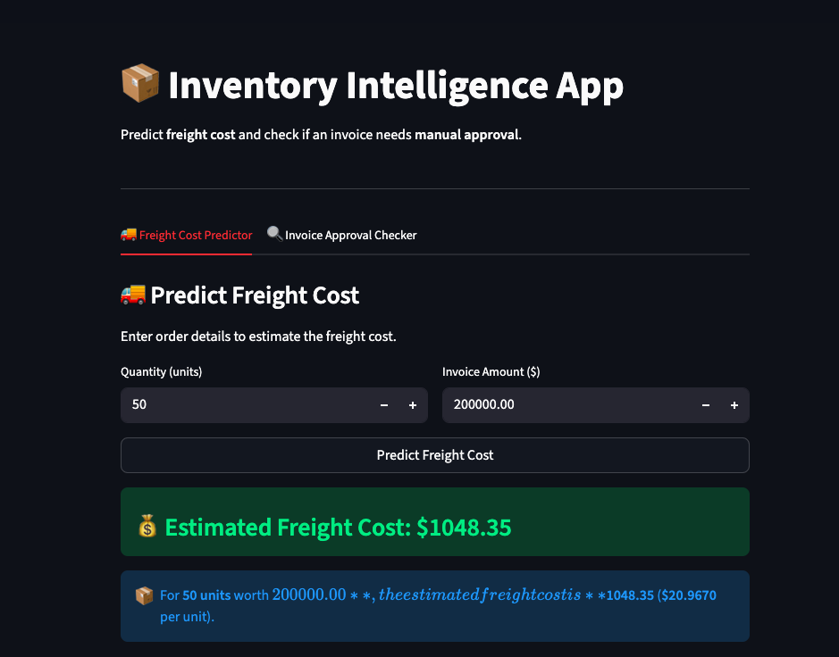
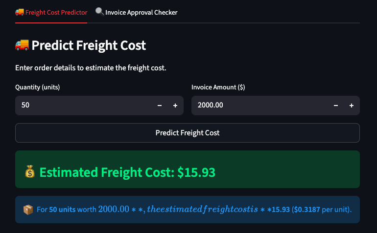
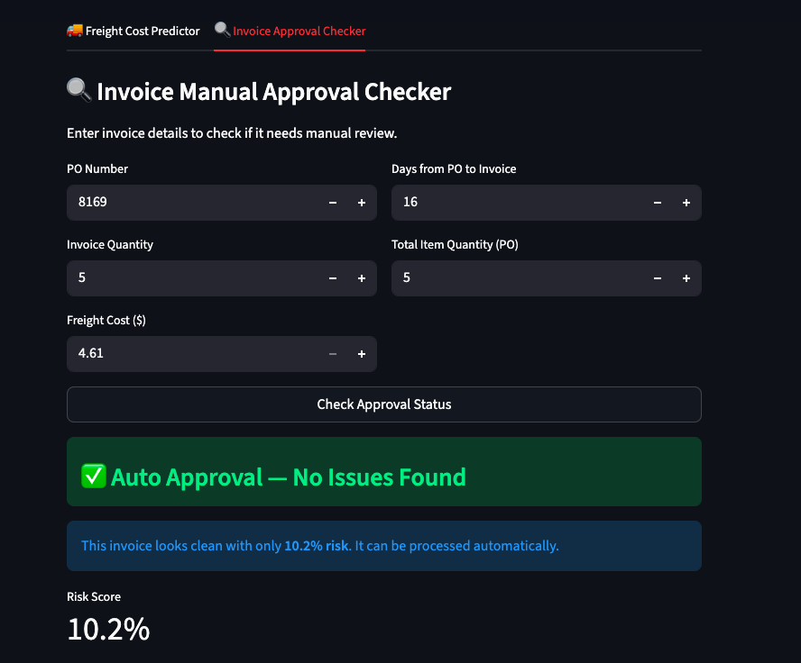

# 📦 Inventory Intelligence App

An end-to-end Machine Learning project that predicts **freight cost** and flags invoices that require **manual approval** — built with scikit-learn and Streamlit.

---

## 📸 App Screenshot
1. HomePage


2. Predict Freight Cost


3. Invoice Mannual Approval Checker


---

## 🎯 Project Goals

| Goal | Type | Model Used |
|------|------|-----------|
| Predict freight cost | Regression | Linear Regression / Random Forest |
| Flag invoices for manual approval | Classification | Random Forest Classifier |

---

## 🗂️ Project Structure

```
Inventory_end_to_end_project/
│
├── app.py                          ← Streamlit app (both tools in one)
├── main_regression.py              ← Run regression pipeline
├── main_classification.py          ← Run classification pipeline
├── requirements.txt                ← All dependencies
├── README.md
├── .gitignore
│
├── src/
│   ├── db_connect.py               ← Shared SQLite connection
│   ├── export_model.py             ← Save & load .pkl files
│   │
│   ├── regression/
│   │   ├── data_loader.py          ← Load vendor data + feature engineering
│   │   ├── train.py                ← Cross validation + train best model
│   │   └── evaluate.py             ← RMSE, MAE, R2 + plots
│   │
│   └── classification/
│       ├── data_loader.py          ← SQL join + risk label creation
│       ├── train.py                ← Train all models + best model
│       └── evaluate.py             ← Accuracy, ROC-AUC, confusion matrix
│
├── models/                         ← Saved .pkl files (auto-created after training)
│   ├── freight_model.pkl           ← Regression model
│   ├── classification_model.pkl    ← Classification model
│   └── scaler.pkl                  ← StandardScaler
│
└── outputs/                        ← All saved plots
    ├── app_ss1.png
    ├── app_ss2.png
    ├── app_ss3.png
    ├── regression_actual_vs_predicted.png
    ├── confusion_matrices.png
    └── feature_importance.png
```

---

## ⚙️ Setup & Installation

### 1. Clone the project
```bash
git clone https://github.com/MaheshPrajapatirepo/Inventory_end_to_end_project-by-Mahesh-.-.git
cd Inventory_end_to_end_project-by-Mahesh-.-.git
```

### 2. Activate your environment
```bash
conda activate ml_env
```

### 3. Install dependencies
```bash
pip install -r requirements.txt
```

---

## 🗄️ Database Setup

`inventory.db` is not included in this repo due to file size (405MB).

**Download from Kaggle:**
👉 [inventory.db — Kaggle Dataset](https://www.kaggle.com/datasets/mahixprajapati/inventory-raw-data)

**After downloading, place it in the project root:**
```
Inventory_end_to_end_project/
└── inventory.db
```

---

## 🚀 How to Run

> ⚠️ Make sure you have downloaded `inventory.db` and placed it in the project root before running.

### Step 1 — Train Regression Model
```bash
python main_regression.py
```
Trains freight cost prediction model and saves `models/freight_model.pkl`

### Step 2 — Train Classification Model
```bash
python main_classification.py
```
Trains invoice approval classifier and saves `models/classification_model.pkl` + `models/scaler.pkl`

### Step 3 — Launch Streamlit App
```bash
streamlit run app.py
```
Opens the app at `http://localhost:8501`

---

## 🧠 Models & Results

### Regression — Freight Cost Prediction

| Model | RMSE | MAE | R2 |
|-------|------|-----|----|
| **Linear Regression** ✅ | **114.58** | **25.41** | **0.9695** |
| Decision Tree | 150.42 | 30.61 | 0.9499 |
| Random Forest | 189.99 | 36.61 | 0.9178 |

> ✅ **Best Model: Linear Regression** — lowest RMSE and highest R2

---

### Classification — Invoice Approval Flag

| Model | Accuracy | ROC-AUC |
|-------|----------|---------|
| Logistic Regression | 82.87% | 85.54% |
| Decision Tree | 91.70% | 92.25% |
| Random Forest | 91.16% | 94.53% |

**Best Model Parameters (Tuned Random Forest):**
```python
{
    'criterion'        : 'gini',
    'max_depth'        : 6,
    'min_samples_leaf' : 1,
    'min_samples_split': 3,
    'n_estimators'     : 200
}
```

---

## 🔍 Features Used

### Regression Features
| Feature | Description |
|---------|-------------|
| `Quantity` | Number of units ordered |
| `Dollars` | Invoice dollar amount |

### Classification Features
| Feature | Description |
|---------|-------------|
| `PONumber` | Purchase order number |
| `invoice_quantity` | Quantity on invoice |
| `Freight` | Freight cost |
| `days_po_to_invoice` | Days between PO and invoice date |
| `total_item_quantity` | Total quantity across all PO items |

### Risk Label Logic
An invoice is flagged (`flag_invoice = 1`) if either condition is met:
- `|invoice_dollars - total_item_dollars| > 5` → dollar amount mismatch
- `avg_receiving_delay > 10` → goods received late

---

## 🖥️ Streamlit App Features

### Tab 1 — 🚚 Freight Cost Predictor
- **Input:** Quantity + Invoice Amount
- **Output:** Estimated freight cost + cost per unit

### Tab 2 — 🔍 Invoice Approval Checker
- **Input:** PO Number, Invoice Quantity, Freight, Days to Invoice, Total Quantity
- **Output:** Approval status + risk score percentage

---

## 🛠️ Tech Stack

| Tool | Purpose |
|------|---------|
| Python 3.12 | Core language |
| pandas | Data manipulation |
| scikit-learn | ML models & pipelines |
| SQLite | Database |
| Streamlit | Web application |
| seaborn / matplotlib | Visualizations |
| scipy | Statistical testing (t-test) |

---

## 👤 Author

**Mahesh Prajapati**
🔗 [GitHub](https://github.com/MaheshPrajapatirepo)

---

## 📝 Notes

- `models/` and `outputs/` folders are auto-created when you run the training scripts
- `inventory.db` must be placed in the project root before running
- All plots are automatically saved to the `outputs/` folder
- This project was built for DSAI study purposes
